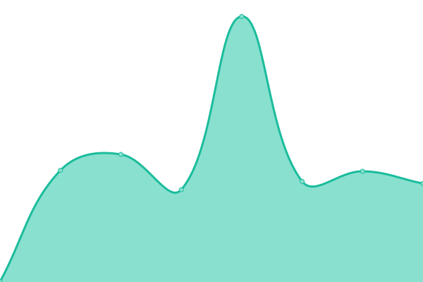
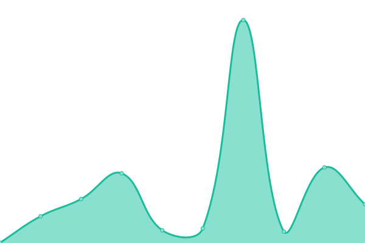

# [📈 Live Status](https://upgrademedia.github.io/upptime): <!--live status--> **🟩 All systems operational**

This repository contains the open-source uptime monitor and status page for [UpgradeMedia, Inc.](https://upgrademedia.com/), powered by [Upptime](https://github.com/upptime/upptime).

With [Upptime](https://upptime.js.org), you can get your own unlimited and free uptime monitor and status page, powered entirely by a GitHub repository. We use [Issues](https://github.com/upgrademedia/upptime/issues) as incident reports, [Actions](https://github.com/upgrademedia/upptime/actions) as uptime monitors, and [Pages](https://upgrademedia.github.io/upptime) for the status page.

<!--start: status pages-->
<!-- This summary is generated by Upptime (https://github.com/upptime/upptime) -->
<!-- Do not edit this manually, your changes will be overwritten -->
<!-- prettier-ignore -->
| URL | Status | History | Response Time | Uptime |
| --- | ------ | ------- | ------------- | ------ |
|  [Hitpiece Client (Staging)](https://staging.hitpiece.com) | 🟩 Up | [hitpiece-client-staging.yml](https://github.com/upgrademedia/upptime/commits/HEAD/history/hitpiece-client-staging.yml) | 

 1697ms
     
 | 

<a href="https://upgrademedia.github.io/upptime/history/hitpiece-client-staging">27.08%</a>
    

|  [Hitpiece Auth via Hasura Backend Plus (Staging)](https://auth-staging.hitpiece.com/healthz) | 🟩 Up | [hitpiece-auth-via-hasura-backend-plus-staging.yml](https://github.com/upgrademedia/upptime/commits/HEAD/history/hitpiece-auth-via-hasura-backend-plus-staging.yml) | 

 209ms
     
 | 

<a href="https://upgrademedia.github.io/upptime/history/hitpiece-auth-via-hasura-backend-plus-staging">26.82%</a>
    

|  [Hitpiece GraphQL Engine via Hasura (Staging)](https://hasura-staging.hitpiece.com/healthz) | 🟩 Up | [hitpiece-graph-ql-engine-via-hasura-staging.yml](https://github.com/upgrademedia/upptime/commits/HEAD/history/hitpiece-graph-ql-engine-via-hasura-staging.yml) | 

 226ms
     
 | 

<a href="https://upgrademedia.github.io/upptime/history/hitpiece-graph-ql-engine-via-hasura-staging">26.77%</a>
    

<!--end: status pages-->

[**Visit our status website →**](https://upgrademedia.github.io/upptime)

## 📄 License

- Powered by: [Upptime](https://github.com/upptime/upptime)
- Code: [MIT](./LICENSE) © [UpgradeMedia, Inc.](https://upgrademedia.com/)
- Data in the `./history` directory: [Open Database License](https://opendatacommons.org/licenses/odbl/1-0/)
